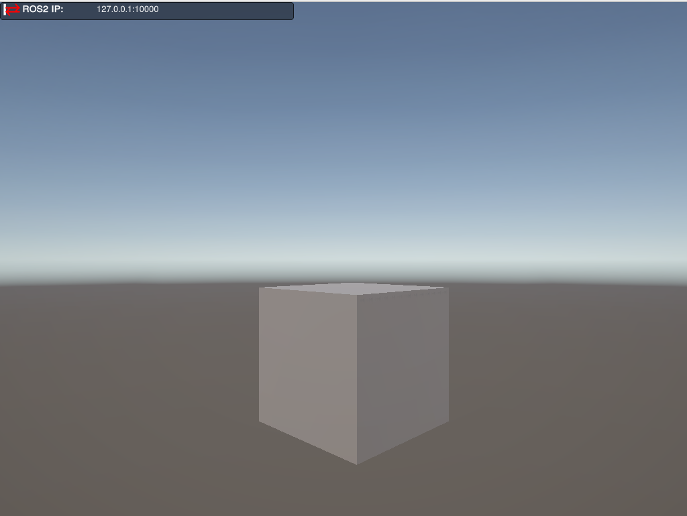
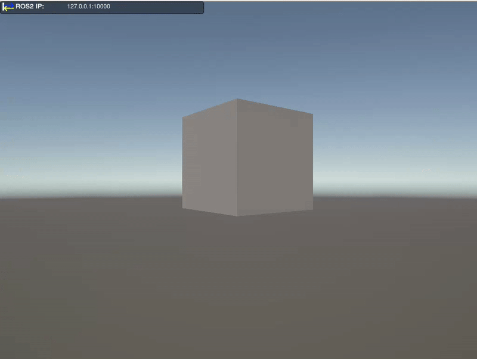

# Unity Simulation Test

This repository provides a simple tutorial demonstrating how to connect a ROS2 node to a Unity simulation.  
The project contains two main folders:

- **RoboticsTestDemo** — a prebuilt Unity simulation  
- **robotics_ws** — a ROS2 workspace configured to communicate with the Unity demo

---


## 1. Running the Unity Simulation

To start the demo environment, open a terminal (`Ctrl + Alt + T`) navigate to the app folder and run the app:

```
cd <path_to_workspace>/RoboticsTestDemo
chmod +x RoboticsTestDemo.x86_64
./RoboticsTestDemo.x86_64
```

A window will open showing a simple scene containing a cube:



## 2. Setting Up the ROS2 Workspace
Open a second terminal (`Ctrl + Alt + T`), navigate to the robotics_ws folder, and install the `ROS_TCP_Endpoint` package:

```
cd <path_to_workspace>/robotics_ws/src
git clone https://github.com/Unity-Technologies/ROS-TCP-Endpoint.git -b main-ros2 
```

`ROS_TCP_Endpoint` enables communication between the Unity simulation and your ROS2 nodes.

Now build and source your workspace:

```
cd ../
colcon build 
source install/setup.bash
```

## 3. Running the Example ROS2 Node

Launch the test node with:

```
ros2 launch pose_test test.launch.py
```

If everything is configured correctly, the cube in the Unity window will begin floating and rotating:



